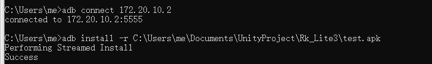

# AR眼镜应用安装指南

## 环境准备
### 1. 网络连接配置
- 将AR眼镜和主机连接到**同一WIFI网络**
- 查看并记录AR眼镜的IP地址（在设备设置中查找）

> **关键提示**：确保网络信号稳定，避免安装中断

### 2. ADB工具安装
安装Android Debug Bridge（ADB）工具包：
```bash
# Windows用户推荐安装包
https://developer.android.com/tools/releases/platform-tools

# macOS/Linux用户可通过包管理器安装
brew install android-platform-tools  # macOS
sudo apt-get install adb             # Ubuntu/Debian
```

**详细教程参考**：  
https://zhuanlan.zhihu.com/p/1888215488703738422

## 安装流程

### 3. 设备连接
```bash
# 替换xxx.xxx.xxx.xxx为实际IP地址
adb connect xxx.xxx.xxx.xxx
```
**预期响应**：  
`connected to xxx.xxx.xxx.xxx:5555`

### 4. APK安装
```bash
# Windows路径示例 替换为你的apk存放路径
adb install -r C:\Users\me\Documents\UnityProject\Rk_Lite3\test.apk

# macOS/Linux路径示例
adb install -r ~/Documents/UnityProject/Rk_Lite3/test.apk
```
<div align="center"> </img></div> 

**安装过程状态说明**：
| 状态提示 | 含义 | 解决方案 |
|---------|------|---------|
| `Performing Streamed Install` | 正常安装中 | 等待完成 |
| `Failure [INSTALL_FAILED_UPDATE_INCOMPATIBLE]` | 版本冲突 | 添加`-r -d`参数强制覆盖 |
| `no devices/emulators found` | 连接失败 | 检查IP和网络连接 |

### 5. 应用验证
1. 在AR眼镜主界面进入**空间应用**菜单
2. 查找新安装的APP图标
3. 点击图标启动应用

## 常见问题排查
### 连接类故障
```bash
# 检查设备列表
adb devices

# 重置ADB连接
adb kill-server && adb start-server
```

### 安装失败处理
```bash
# 卸载冲突版本
adb uninstall com.example.packagename

# 重新安装（强制模式）
adb install -r -d path/to/test.apk
```

> **注意**：建议保持ADB版本≥33.0.3以获得最佳兼容性
