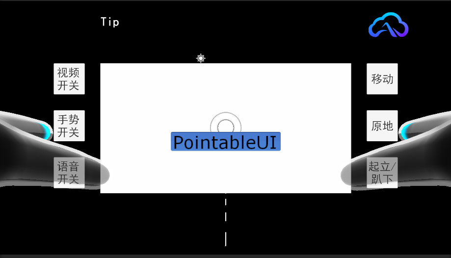
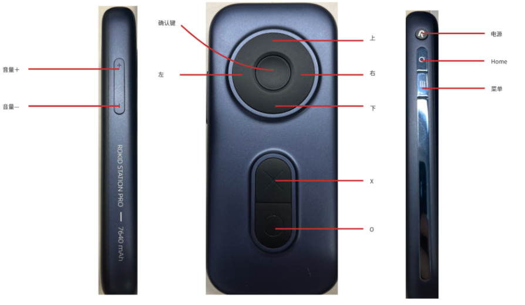
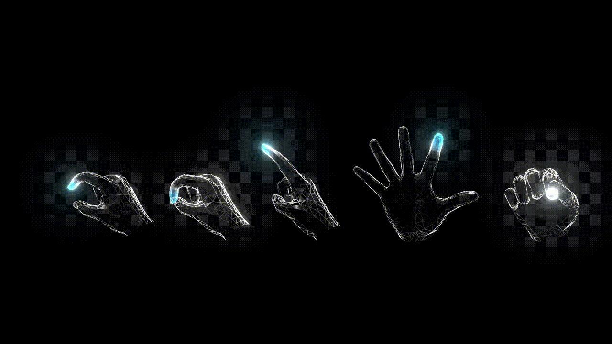
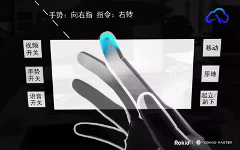
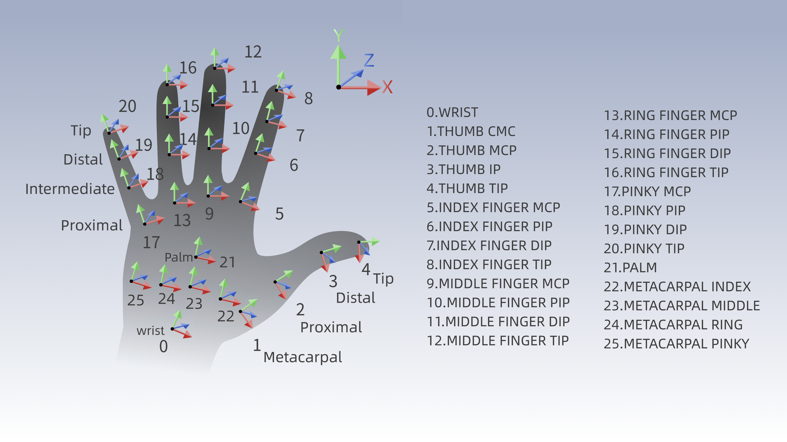

# 绝影Lite3机器狗AR控制应用

<div align="center"> </img></div> 
基于Rokid AR studio设备，通过手势、语音和手柄控制云深处绝影Lite3基础版机器狗，实现对机器狗的基本行动指令与特殊动作的实时下发与控制。

## 功能特性

- **多模态控制**: 支持手势识别、语音指令和手柄控制三种交互方式
- **实时视频流**: 实时显示机器狗前端广角摄像头传回的图像
- **动作控制**: 支持基础移动指令和特殊表演动作
- **离线语音识别**: 集成Rokid离线语音模块，识别固定指令词

## 快速开始

### 硬件准备
1. 绝影Lite3基础版机器狗
2. Rokid AR studio设备（眼镜+控制器）
3. 确保设备电量充足


### 连接与启动
1. 开启Lite3和AR眼镜
2. 将AR眼镜连接到机器狗对应的WIFI（YSC-*****-*****-5G，默认密码12345678）
3. 在AR眼镜中打开本应用
4. 使用控制器操作界面，开始控制机器狗

## 控制方式

### 手柄控制
- 使用控制器移动射线并按下"确认键"操作UI按钮
- 控制机器狗切换趴下/起立、原地/移动等状态
- 按下控制器"O"键打开/关闭语音识别功能
<div align="center"> </img></div> 

### 语音指令
按下控制器"O"键后，可使用以下语音指令：

| 指令 | 功能 |
|------|------|
| "起立" | 机器狗站立 |
| "坐下" | 机器狗坐下 |
| "前进" | 向前移动 |
| "后退" | 向后移动 |
| "向左走" | 向左移动 |
| "向右走" | 向右移动 |
| "停止" | 停止移动 |
| "向左转" | 向左转身 |
| "向右转" | 向右转身 |
| "打招呼" | 执行打招呼动作 |
| "后空翻" | 执行后空翻动作 |
| "扭身体" | 执行扭身体动作 |
| "向前跳" | 向前跳跃 |
| "扭身跳" | 执行扭身跳动作 |
| "太空步" | 执行太空步动作 |
| "翻身" | 执行翻身动作 |
| "结束表演" | 结束表演动作 |
| "匍匐" | 执行匍匐前进 |

**注意**: 语音指令后需要加上"停止"指令来清除状态。持续表演动作需要使用"结束表演"来停止。

### 手势控制
如图为Rokid 提供的基础手势，图中一共5种手势，分别为OpenPinch、Pinch、近场单指、Palm、Grip
<div align="center"> </img></div> 

| 功能 | 手势动作 |
|------|----------|
| 手势关 | 暂停 |
| 手势开 | 竖起大拇指 |
| 起立 | 四指张开，手心朝向 |
| 趴下 | 四指张开，手背朝向 |
| 软急停 | 捏合手势 |
| 前进 | 四指并拢，手背朝向 |
| 后退 | 四指并拢，手心朝向 |
| 停止 | 握拳 |
| 向左转 | 向左指 |
| 向右转 | 向右指 |
| 太空步 | 三指伸直 |
| 打招呼 | 二指伸直 |
以下为手势指令识别的演示视频（没有实际连接机器狗）：

<div align="center"> </img></div> 

## 开发指南

### 环境要求

#### 硬件环境
- 可进行Unity开发的PC设备（Mac或Windows）
- Rokid Station Pro/Rokid Station2设备
- Rokid Max Pro/Rokid Max/Rokid Max2眼镜

#### 软件环境
- Unity 2022 LTS版本
- Android Build Support环境：
  - Android SDK
  - NDK Tools
  - OpenJDK
- 移动平台支持：Android Platform号码28至34
- YodaOS系统版本不低于v3.30.003-20250120-800201

### 核心功能实现

#### 视频流图传
使用VLC for Unity解码RSTP视频流：
```
rtsp://192.168.2.1:8554/test
```

!images/video-stream.png <!-- 请根据实际图片路径修改 -->

#### UDP通信协议
与运动主机采用UDP协议，小端字节序存放原始数据。

简单指令结构体：
```csharp
struct CommandHead{ 
    uint32_t code; 
    uint32_t paramters_size; 
    uint32_t type; 
};
```

示例指令：
- 起立：code= 0x21010C0A, paramters_size = 1, type = 0
- 心跳指令：code= 0x21040001, paramters_size = -, type = 0（下发频率不低于2Hz）

#### 手势识别API
使用Rokid UXR 3.0手势识别接口：

```csharp
// 获取掌心朝向
HandOrientation orientation = GesEventInput.Instance.GetHandOrientation(HandType handType);

// 获取手势类型
GestureType gesture = GesEventInput.Instance.GetGestureType(HandType handType);

// 获取骨骼信息
Pose pose = GesEventInput.Instance.GetSkeletonPose(SkeletonIndexFlag flag, HandType type);
```

<div align="center"> </img></div> 

### 参考文档
1. https://ar.rokid.com/sdk
2. 云深处《绝影Lite3运动主机通讯接口(beta) V1.0.7》(目前没有找到公开的版本)

## 注意事项
- 确保机器狗和AR眼镜连接到同一WIFI网络
- 语音指令与其他控制方式可能存在冲突，使用时请注意状态管理
- 持续表演动作需要使用"结束表演"指令来停止
- 保持心跳指令以不低于2Hz的频率发送以确保连接正常

## 支持
如有问题或需要进一步技术支持，请参考上述开发文档或联系相关技术支持团队。